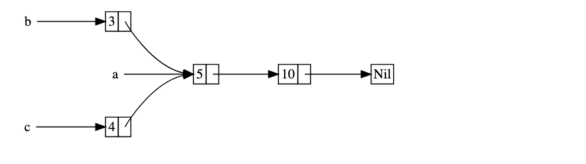

# Rc<T>, The Reference Counted Smart Pointer

in the majority of cases, ownership is clear: you know exactly which variable owns a given vaule.

However, there are cases then a single value might have multiple owners.

For example, in graph data structures, multiple edges might point to the same node, and thus the node is conceptually owned by all of the edges that point to it. A node should not be freed if it is still owned by at least one edge.

You have to enable multiple ownership explicitly by using the Rust type Rc<T>, which is an abbreviation for reference counting. The Rc<T> type keeps track of the number of references to a value to determine whether or not the value is still in use. If there are zero references to a value, the value can be cleaned up without any references becoming invalid.

We use the Rc<T> type when we want to allocate some data on the heap for multiple parts of our program to read and we can't determine at compile time which part will finish using the data last.

If we knew  which part would finish last, we could just make the part the data's owner.

Note that `Rc<T>` is only for use in sigle-threaded scenarios.

## Using Rc<T> to Share Data

Let's return to our cons list example in Listing. Recall that we defined it using Box`<T>`

We’ll create list a that contains 5 and then 10. Then we’ll make two more lists: b that starts with 3 and c that starts with 4. Both b and c lists will then continue on to the first a list containing 5 and 10. In other words, both lists will share the first list containing 5 and 10.

The implementation of Rc::clone doesn’t make a deep copy of all the data like most types’ implementations of clone do. The implementation of Rc::clone only increments the reference count.

## Cloning and Rc<T> Increases the Reference Count

Let’s change our working example in Listing 15-18 so we can see the reference counts changing as we create and drop references to the Rc<List> in a.
